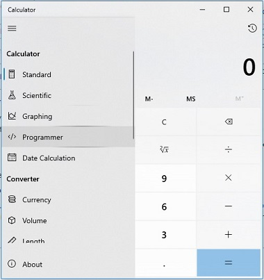
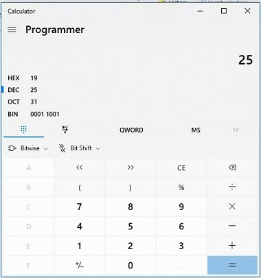

# Bases

Before we jump right into what a base is, I first want to talk to you about a fancy sounding couple of word: "Discrete"

The word `discrete` comes from the latin word _discretus_, which means "separated." The more familiar word "discern" comes from the same roots.

Lets take an example sentence, "I can _discern_ between left and right." This sentence can be rewritten using the word _discrete_ instead: "I know that left and right are two _discrete_ things."

We use the words "discrete values" to describe several things that are different, but can be considered the same type. For example, "red, blue, and green" are discrete values, but they are all colors. "1, 2, 3" are discrete values but they are all numbers. "left and right" are discrete values but they are both directions.

A `base` is the number of _discrete values_ that each digit can have. In western culture, we use base-10. This means that every digit in our number system has 10 discrete values. These discrete values are written with the following symbols: `0`, `1`, `2`, `3`, `4`, `5`, `6`, `7`, `8`, `9`.

Notice that I said "_in western culture_". This is because the base of the system we use is purely cultural. Base-10 is very natural for us, but other cultures around the world use different base systems. The mayans used a base-20 system. That means that every digit had 20 discrete values. That is, they had 20 discrete values for every digit in their numbers.

Visualizing number systems in bases higher than 10 is difficult because we only have 10 number symbols to work with. This is natural, we all use base 10 so why would we need more symbols than that? If we want to represent the number "10", we use two digits, `1` and `0`. If we used base-11, then we would have a single digit to represent the number "10".

There is one interesting instance where we use a higher base in western culture. We sometimes represent time in base 60. How is this, though? When I say its 2:46, that looks like base 10, and you would be right. To write it in base 60, we would need a number system with 60 discrete values. What kind of symbol do we have that can represent 60 discrete values? I will give you a hint, its round, we hang it on the wall or wear it on our wrist, and has hands on it.

What if we did want to write numbers in higher bases? We don't have a symbol to specify "11" in a single digit. To get around this, we start borrowing symbols from elsewhere. We happen to pick letters, starting at the beginning of the alphabet. So if we want to use base-11, we (as a culture) have decided to borrow the letter "a" to mean "11". So, in base-11, the number "a" would mean "11" in base-10.

This brings up a slight problem. If I write "aaaaa", am I writing a number in base-11, or am I yelling? There is no way to know. It entirely depends on context. If I say "I have aa cookies" it makes more sense that I'm explaining that I have a lot of cookies. If I say "aa I have cookies" I am probably just excited that I have cookies. In day to day living, we don't use anything other than base 10 so in a normal context if I wrote "I have aa cookies" you'd think I've lost my marbles. In the word of Computer Science, using different bases is much more common.

This brings up another problem: what if we use a base _less than_ 10? For instance, base-5 has 5 discrete values for each digit: `0`, `1`, `2`, `3`, `4`. If I write the number "12", have I written it in base-10 or base-5? "12" in base-5 is equal to "7" in base-10, so knowing which base a number is written in is very important. Again, in our day to day activities, we always assume base-10. This entire document you are reading has been using base-10 to write numerals, even though it has been writing numbers in other bases. Every time I represent a number in another base, I have to be very clear, such as how I wrote _"12" written in base-5_ above. Since base-10 is the only base we use, we never have to say what base we are using. We are always on the same page. In computer science, using different bases is more common, so we need to be much more clear about what base we are writing our numbers in.

Saying _"12" written in base-5_ is clunky. What if there was a faster, more compact way of saying the same thing? Computer scientists have done just that. We write special symbols in front of a number that gives us a heads up for what base it is written in. Below is a table of all the bases we commonly use:

| Base | Prefix | Name                | Example |
| ---- | ------ | ------------------- | ------- |
| 2    | 0b     | **Bi**nary          | 0b1011  |
| 8    | 0      | **Oct**al           | 033     |
| 10   | (None) | **Dec**imal         | 425     |
| 16   | 0x     | **Hex**i**dec**imal | 0x3a5   |

These are all the bases commonly used in computer science. In the next chapter we will explain why these bases in particular are important.

And now, an extremely nerdy computer science joke: "Why do programmers get Halloween and Christmas mixed up? Because oct-31 is dec-25!" 31 in base-8 is 31 in base-10.

Converting between different bases can be pretty annoying. The calculator built into windows can do this for you though:

